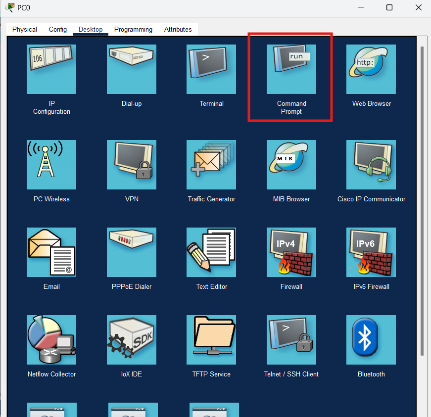
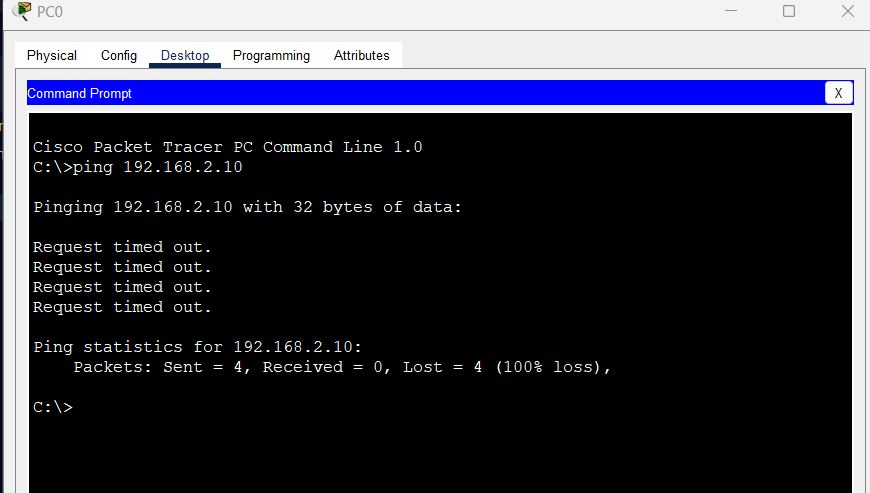
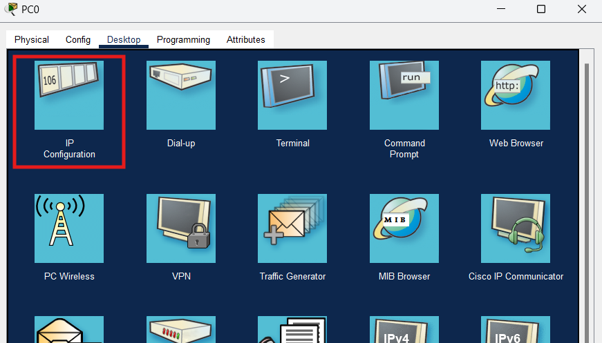
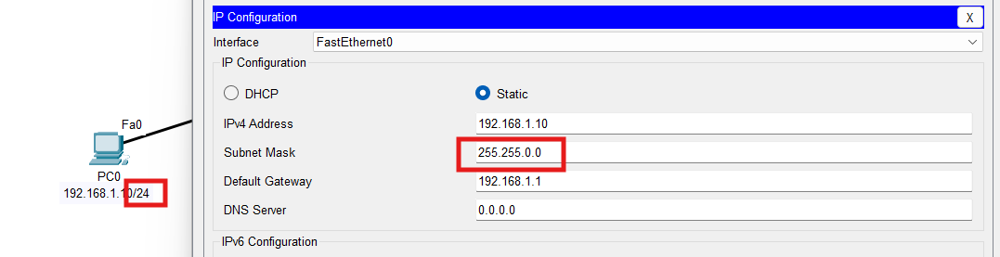
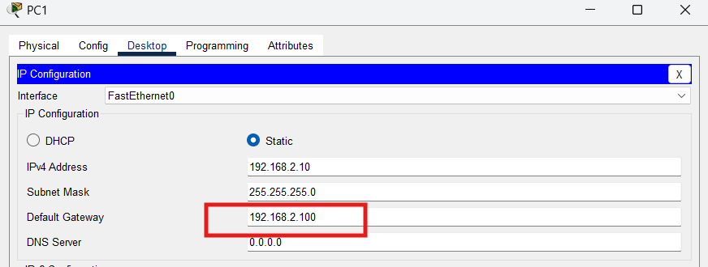
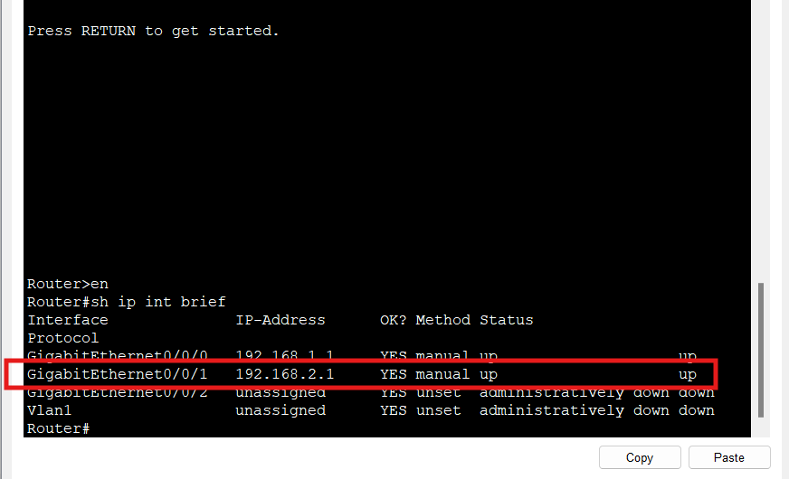

# Simple Communication between devices

### In this lab the objective is to ping PC1 from PC0

First, click on PC0 and go to the command prompt

When we try to ping PC1 (192.168.2.10) we can see that the host is unreachable and that the request time out

First, let's go look in the PC0 config and try to see what's going on.

Click on PC0 but this time let's go in IP configuration 

When we look at the inforamtions, we see clearly that the subnet mask is wrong compared to the note on the PacketTracer !

Change the subnet mask to *255.255.255.0* in the IP configuration menu and try again to ping PC1

The ping still doesn't work so we will have to do the same troubleshoot on PC1

Repeat the same steps for PC1

This time on PC1 we can see that the IPv4 address and the subnet mask are correct but the gateway seems off

To be sure that this is an error, we will go look diretcly inside the router

Following these commands, we see that the gateway used on PC1 is different from the IPv4 address on the port G0/0/1 on the router.

Now that we are sure that the configuration on PC1 is incorrect, we can change the default gateway to *192.168.2.1* and the ping will now work!

#### **Solution made by itsal3xis**
